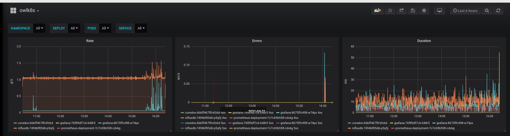

# Influxdb+Grafana example

This shows how to use owlk8s with influx and grafana.
It includes grafana and influxdb k8s deployment objects located in their respective folders in this tree. These had been tested with latest minikube.

**Make sure your kubectl config context points to the right cluster**
## Deploy Grafana
```
cd grafanaDeployment
kubectl create ns grafana
./create-grafana-configmap.sh grafana
kubectl -n grafana apply -f grafana-deploy.yaml
```
## Deploy Influxdb
```
cd influxDeployment
kubectl create ns influxdb
./createInfluxSecret.sh
kubectl -n influxdb apply -f influx-deploy.yaml
cd ../
```
## Build and deploy example powered by owlk8s
```
./build.sh
kubectl apply -f clusterrolebinding.yaml
kubectl apply -f owlk8s-ds.yaml
```

All this is assuming minikube is used. If a real cluster is used images have to be pushed to container registry and DaemonSet manifest should be updated to use that, build.sh script needs changing...

Result should be something like this:

